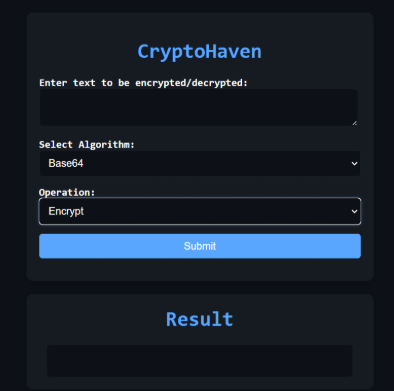

# CryptoHaven

 


## ✒️ Description

Our application is to be used for all your cryptography needs. We have several different cryptography methods to choose from as well as two made on our own. 
It's all done locally so there's little chance for any information put through our program to be compromised. If you need your information encrypted/decrypted, this is the app for you.

## 🛠 Installation Steps


1. **Clone the repository in your terminal:**
   ```bash
   git clone https://github.com/JoshKrav/CryptoHaven
   ```
   
   3.**Place Repo In Any Application That Can Run Python(e.g Visual Studio Code):**

   4.**Install Necessary Packages**
   In your application's terminal:
   ```bash
   pip install flask
   pip install pycipher  
   ```
   4.**Enjoy!**

### 📚 References

-   https://cryptography.io/en/latest/

-   https://pycryptodome.readthedocs.io/en/latest/src/cipher/cipher.html

-   https://pycipher.readthedocs.io/en/master/

-   https://docs.python.org/3/library/base64.html

-   https://flask.palletsprojects.com/en/stable/

-   https://www.geeksforgeeks.org/rail-fence-cipher-encryption-decryption/

